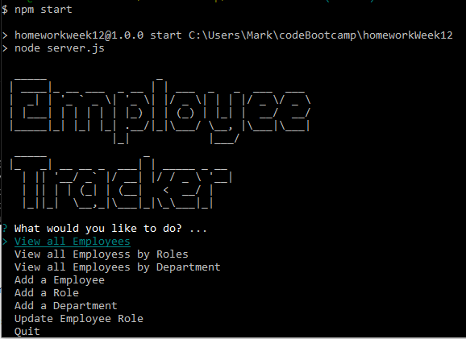

# Employee Tracker

## Description

This Node.js application that is used to track employees names, roles, departments, and salaries.

## Usage
execute by typing:
    node server.js
        or
    npm start

then follow the prompts to view, add, or update the information.
## Installation

use the seed.sql file to build your database with the required tables, and columns
    then
  update server.js with "your mysql password" in the password: "" part
  also update "user: root" if needed.

Requires enquirer, mysql, and figlet

use:
    npm install
    to install all the require packages

FAILURE to seed your database, AND change server.js with mysql password, AND npm install
    WILL RESULT IN FAILURE OF THE PROGRAM
